```mermaid
flowchart TD
    START([Start: User clicks\nAuto-spárovať podľa VS]) --> SET_FLAG[Set autoPairing = true\nClear message]

    SET_FLAG --> LOAD_STUDENTS[Load ALL students\nfrom Firestore]

    LOAD_STUDENTS --> BUILD_MAP["Build Map: VS → studentId[]
    For each student:
      normalize VS to string
      push studentId into map entry"]

    BUILD_MAP --> LOAD_CANDS["Filter candidate payments
    (matchStatus ≠ 'matched'
     OR matchedStudentId = null)"]

    LOAD_CANDS --> INIT["Initialize:
    matchedCount    = 0
    ambiguousCount  = 0
    unchangedCount  = 0
    batchUpdates    = []"]

    INIT --> LOOP_CHECK{More candidate\npayments?}

    %% ── MAIN LOOP ──────────────────────────────────────
    LOOP_CHECK -->|No| CHUNK_SPLIT
    LOOP_CHECK -->|Yes| NEXT[Get next payment\nnormalize VS to string]

    NEXT --> VS_EMPTY{VS is\nempty?}
    VS_EMPTY -->|Yes| INC_UNCHANGED[unchangedCount++]
    INC_UNCHANGED --> LOOP_CHECK

    VS_EMPTY -->|No| MAP_LOOKUP["Look up VS in studentsByVS
    → matchedStudents[]"]

    MAP_LOOKUP --> MATCH_COUNT{How many students\nshare this VS?}

    %% ── 0 MATCHES ──────────────────────────────────────
    MATCH_COUNT -->|"0 matches"| NO_MATCH[No student found\nunchangedCount++]
    NO_MATCH --> LOOP_CHECK

    %% ── 1 MATCH ────────────────────────────────────────
    MATCH_COUNT -->|"1 match"| ONE[targetStudentId = matchedStudents 0]
    ONE --> ALREADY_OK{"Already matched\nto same student?"}
    ALREADY_OK -->|Yes| SKIP1[unchangedCount++]
    SKIP1 --> LOOP_CHECK
    ALREADY_OK -->|No| ADD_MATCHED["Add to batchUpdates:
    matchedStudentId: targetStudentId
    matchStatus: 'matched'
    matchedCount++"]
    ADD_MATCHED --> LOOP_CHECK

    %% ── 2+ MATCHES ─────────────────────────────────────
    MATCH_COUNT -->|"2+ matches"| MULTI[Multiple students\nshare this VS]
    MULTI --> ALREADY_AMBIG{"Already set\nto ambiguous?"}
    ALREADY_AMBIG -->|Yes| SKIP2[unchangedCount++]
    SKIP2 --> LOOP_CHECK
    ALREADY_AMBIG -->|No| ADD_AMBIG["Add to batchUpdates:
    matchedStudentId: null
    matchStatus: 'ambiguous'
    ambiguousCount++"]
    ADD_AMBIG --> LOOP_CHECK

    %% ── BATCH WRITE ────────────────────────────────────
    CHUNK_SPLIT["Split batchUpdates into\nchunks of 450 documents\n(Firestore batch limit = 500)"]
    CHUNK_SPLIT --> BATCH_LOOP{More\nchunks?}

    BATCH_LOOP -->|Yes| WRITE["Create writeBatch
    Update each payment doc
    in chunk → batch.commit"]
    WRITE --> BATCH_LOOP

    BATCH_LOOP -->|No| SUCCESS["Show result message:
    ✅ Spárované:      matchedCount
    ⚠️  Nejednoznačné: ambiguousCount
    —  Bez zmeny:     unchangedCount"]

    SUCCESS --> RELOAD[Reload payments\nfrom Firestore]
    RELOAD --> END([End: autoPairing = false])

    %% ── ERROR PATH ─────────────────────────────────────
    LOAD_STUDENTS -->|Firestore error| ERR[Show error message]
    WRITE -->|Firestore error| ERR
    ERR --> END

    %% ── STYLES ─────────────────────────────────────────
    style START fill:#2ECC71,color:#000
    style END fill:#2ECC71,color:#000
    style BUILD_MAP fill:#AED6F1,color:#000
    style MAP_LOOKUP fill:#AED6F1,color:#000
    style CHUNK_SPLIT fill:#AED6F1,color:#000
    style WRITE fill:#AED6F1,color:#000
    style ADD_MATCHED fill:#A9DFBF,color:#000
    style ADD_AMBIG fill:#FAD7A0,color:#000
    style NO_MATCH fill:#F5CBA7,color:#000
    style ERR fill:#F1948A,color:#000
    style SUCCESS fill:#D5F5E3,color:#000
    style INIT fill:#EBF5FB,color:#000
```

# Flowchart: Payment Auto-Matching by VS

**Source:** `dst-crm/src/components/PaymentsManagement.tsx` → `autoAssignByVS()`

**Purpose:** Automatically pairs imported payments to students by comparing the payment's
variable symbol (`vs`) against each student's `vs` field. Handles exact matches, ambiguous
matches (multiple students share a VS), and unmatched cases. Uses Firestore batch writes.

---

---

## Algorithm Summary

| Step | Operation | Complexity |
|------|-----------|-----------|
| Build student map | Iterate all students once | O(n) |
| Filter candidates | Iterate all payments once | O(m) |
| Main loop | For each candidate, O(1) map lookup | O(m) |
| Batch write | Firestore batch commits in ≤450 chunks | O(b/450) |

**Legend:**
- 🟢 Green — Start / End
- 🔵 Blue — Data operations (Firestore read/write, map build)
- 🟩 Light green — Match confirmed → write `matched`
- 🟧 Orange — Ambiguous match → write `ambiguous`
- 🟥 Red — Error path
